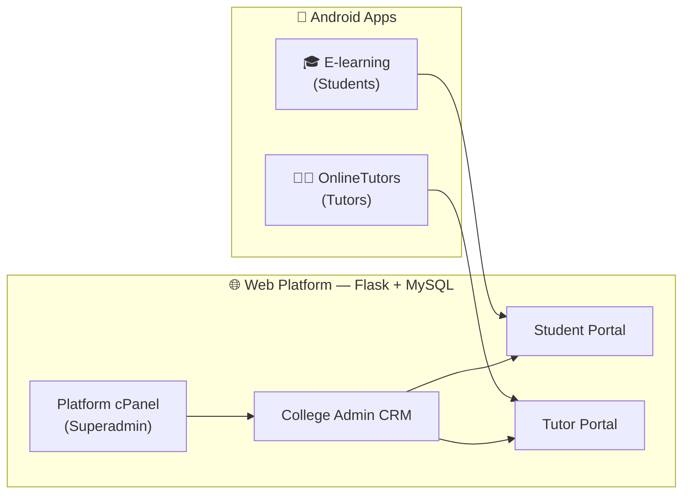

<div align="center">

# 🎓 Online eLearning Platform

**A complete multi-college eLearning management system — one web platform, two mobile apps.**

[](#-the-web-platform)
[](#-the-mobile-apps)
[](#-tech-stack)
[](#-tech-stack)
[](https://github.com/boyoftime/online-elearning/releases/latest)

**Live portal:** [elearning.someless.top](https://elearning.someless.top)

</div>

---

## 📥 Download the Apps (v1.0)

| App | For | What it opens | Download |
|---|---|---|---|
| 🎓 **E-learning** | Students | Student portal login | [⬇ E-learning-1.0-release.apk](https://github.com/boyoftime/online-elearning/releases/latest/download/E-learning-1.0-release.apk) |
| 👩‍🏫 **OnlineTutors** | Tutors / Teachers | Tutor portal login | [⬇ OnlineTutors-1.0-release.apk](https://github.com/boyoftime/online-elearning/releases/latest/download/OnlineTutors-1.0-release.apk) |

> Both apps install side by side on the same phone. Android 6.0 (API 23) or newer. ~2 MB each.

---

## 🌍 What is this project?

**Online eLearning Platform** is a full college management and eLearning system built for real institutions. It is **multi-tenant**: many colleges run on the same platform, each with its own URL slug, its own logo and branding, its own admins, tutors, students, subjects and courses — all completely isolated from each other.

The platform has **four experiences**:



| Role | Who they are | Where they work |
|---|---|---|
| **Student** | Learners enrolled in a college | E-learning app / student portal |
| **Tutor** | Teachers assigned to subjects | OnlineTutors app / tutor portal |
| **College Admin** | Staff managing one college | Admin CRM dashboard |
| **Platform Superadmin** | Owner of the whole platform | cPanel (manages all colleges) |

---

## 📱 The Mobile Apps

Both apps are **native Android (Kotlin)** wrappers around the portals — small, fast, and built for low-end phones and slow networks.

### 🎓 E-learning — the student app
Opens straight into the **student login**. Students can:
- Sign in and stay signed in (session and cookies persist across launches)
- See their dashboard: course, subjects, and enrollment status
- View **My Tutors** — automatically matched by the subjects they take
- Manage their profile, change their password, upload a profile photo (camera or gallery)

### 👩‍🏫 OnlineTutors — the tutor app
Opens straight into the **tutor login**. Tutors can:
- Sign in to their teaching dashboard: assigned general and core subjects, courses, student counts
- View **My Students** — automatically derived from shared subjects
- Manage their profile, photo, and password

### Shared app engine (both apps)
| Feature | Detail |
|---|---|
| 🚀 Branded splash | Logo splash that fades out when the first page loads |
| 📊 Progress bar | Gradient top loading bar tracking every page load |
| 🔙 Smart back button | Navigates web history first, then exits |
| 📡 Offline screen | Friendly "Try again" screen when there's no connection |
| 📎 File uploads | Document picker **plus** "take a photo" for profile pictures |
| ⬇ Downloads | PDFs and files via Android DownloadManager with the session attached |
| 🔗 Smart links | `mailto:`, `tel:`, WhatsApp and external sites open in the right app |
| 🌙 Dark mode | Full dark theme support |
| 🔒 Security | HTTPS-only — cleartext HTTP blocked, bad certificates rejected, old `http://` links auto-upgraded |
| 📐 Edge-to-edge | Android 15 ready |

---

## 🌐 The Web Platform

A server-rendered **Flask** application with a modern CRM interface (Material Symbols icons, light/dark theme, animated navigation).

### 🏫 Multi-tenancy — many colleges, one platform
- Every college gets a clean URL slug: `/<college>/login`, `/<college>/student/...`, `/<college>/tutor/...`
- Each college has a private **access token** used at the front door to reach its admin login — invalid tokens reveal nothing about which colleges exist
- All data is scoped per college at the database level; sessions are namespaced so an admin, a student, and a tutor can be signed in from the same browser without kicking each other out
- Per-college **logo upload** (auto-converted to WEBP) branding the login pages and portals

### 🛠 College Admin CRM
- **Dashboard** with live counts and stats
- **Subjects** — full CRUD, typed as *general* or *core*
- **Courses** — names are auto-composed from their core subjects, with duplicate detection, abbreviations, and durations
- **Students** — registration with auto-generated student IDs, intakes, course and subject assignment, profile photos
- **Tutors** — registration and subject assignment
- **Admins** — create, edit, delete, and reset admin accounts (with a protected super-admin that can never be removed)
- **Settings** — intakes, course durations and statuses, help-desk contacts, login-page about message, core-subject limits, college logo

### 🖥 Platform cPanel (superadmin)
- Create, activate, deactivate, and manage every college on the platform
- Per-college statistics (admins, students, courses)
- Regenerate a college's access token at any time

### 🔐 Security highlights
- Password hashing (Werkzeug), never plain text
- **5 failed logins → 6-hour automatic account lockout**
- Session-driven authorization — access is never trusted from the URL
- Protected break-glass super-admin enforced in both UI and API
- HTTPS end-to-end, `client_max_body_size` limits on uploads

---

## ⚙️ Tech Stack

| Layer | Technology |
|---|---|
| Backend | Python 3.12 · Flask 3.1 · Jinja2 · Gunicorn |
| Database | MySQL 8 (PyMySQL) |
| Images | Pillow — all uploads converted to WEBP |
| Frontend | Server-rendered Jinja + fetch/AJAX · Google Material Symbols · light/dark theming |
| Deployment | Docker (`python:3.12-slim` + `uv`) · docker-compose · Nginx reverse proxy |
| Mobile | Kotlin · AndroidX · Material 3 · Gradle 8 / AGP 8.11 · minSdk 23 / targetSdk 35 |

---

## 🗺 Repository layout

```
online-elearning
├── README.md                        ← you are here
├── E-learning-1.0-release.apk      ← student app (also in Releases)
└── OnlineTutors-1.0-release.apk    ← tutor app (also in Releases)
```

> The platform source code (web app + both Android projects) is developed privately. This public repository hosts documentation and official app releases.

---

## 👨‍💻 Credits

<div align="center">

### Developed by **Samwel Adonia**

Design · Backend · Web · Android · Deployment

*All credit for the design and development of this system goes to Samwel Adonia.*

</div>

---

<div align="center">

© 2026 Online eLearning Platform · Made with ❤️ by **Samwel Adonia**

</div>
